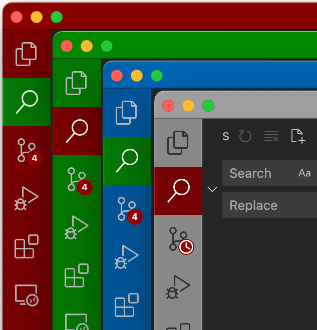
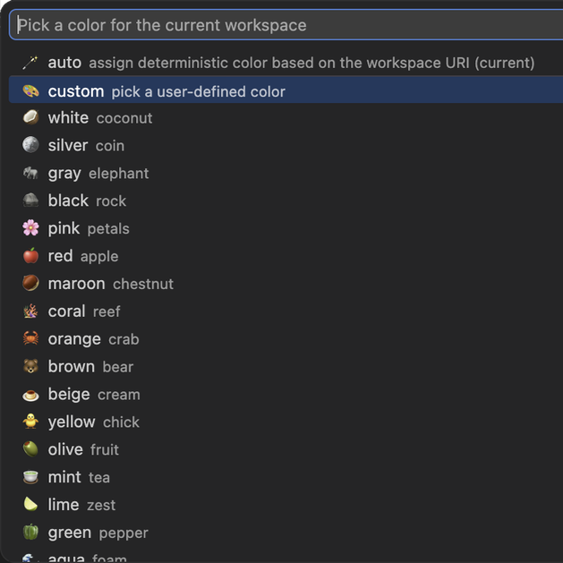

# Window and Workspace Accents in Color!

Add color accents to easily distinguish VS Code windows, workspaces, and `git worktrees`!
A lightweight, open-source alternative to the `Window Colors` and `Peacock` extensions:

1. **Just Works:** Provides a great out of the box experience by automatically recognizing project's context. For example, a folder named `project-hotfix` will default to a `red` color accent. See [Color Recognition](#color-recognition) below for more details.
2. **Tiny:** Less than 300 lines of code.
3. **Subtle:** Modifies only the Activity Bar and Title Bar, keeping the rest of the UI intact.
4. **Deterministic:** The same workspace will always receive the exact same color accent.
5. **Customizable:** Not a fan of the automatic selection? Just run the `Color!: Pick a workspace color` command and choose the `custom` option to input your own exact color!




## Quick Start

1. Open a project, and the extension will automatically detect the context and select a color accent.
2. Open the Command Palette (`Cmd + Shift + P` or `Ctrl + Shift + P`) and run the `Color!: Pick a workspace color` command to override the automatic selection.

## Frequently Asked Questions

### 1. The extension is not working and the color isn't changing

This usually happens when a workspace URI is unavailable. Please open a folder or a workspace and try again.

### 2. My `.vscode/settings.json` file is getting modified all the time

VS Code stores per-window color settings either in the workspace configuration file (e.g., `my_project.code-workspace`) or directly inside the folder (e.g., `my_project/.vscode/settings.json`).

If `my_project/.vscode/settings.json` file is tracked by a version control system like Git, it is best practice to save the workspace outside of `my_project` folder using `File > Save Workspace As...`, like this:

```text
my_project.code-workspace
my_project/
    .vscode/
        settings.json
    [...]
```

Note: The `my_project.code-workspace` file should not be tracked by Git and should live outside of the project folder (or be explicitly added to the `.gitignore` file).

Now, when the `my_project.code-workspace` is opened, all window color preferences will be safely stored there, and any local `.vscode/settings.json` color modifications will be avoided.

### 3. My `.code-workspace` file is getting modified all the time

Save the workspace locally under a different name outside of the tracked folders, or add it directly to the `.gitignore`.

See the question above for more details.

## Color Recognition

The extension automatically matches segments of the workspace folder name when separated by a dot, dash, or underscore (e.g., `my-project.red` or `my-project-fix`).

The color recognition logic follows three steps:

1. **Color Names:** If the folder name contains an explicit color name, it applies that color accent.
   * *Supported:* `white`, `silver`, `gray`, `black`, `pink`, `red`, `maroon`, `coral`, `orange`, `brown`, `beige`, `yellow`, `olive`, `mint`, `lime`, `green`, `aqua`, `cyan`, `blue`, `navy`, `violet`, `magenta`, `fuchsia`, `purple`.
   * *Example:* `my-project.red` or `analytics-navy`

2. **Branch Names:** If no explicit color is found, the extension falls back to matching the folder name against common branch names or project types.
   * *Supported:* `main`, `master`, `dev`, `devel`, `feat`, `feature`, `fix`, `hotfix`, `release`, `refactor`, `test`, `spec`, `experiment`, `experimental`, `chore`, `infra`, `core`, `shared`, `frontend`, `backend`, `api`.
   * *Example:* `my-project-main` or `auth-service_fix`

3. **Deterministic URI Digest:** If no explicit color or branch keyword matches, the extension automatically assigns a stable, unique color hashed directly from the workspace URI.

While this default behavior offers a great out of the box experience, the automatic selection can be easily overridden by running the `color.pick` command or manually setting the `color.selected` configuration.

## Extension Settings

This extension contributes the following settings:

* `color.selected`: Selected workspace color (default: `auto`). Possible values are `auto` (deterministic based on the workspace URI), `custom` (user-entered hex color), and a set of named predefined colors.
